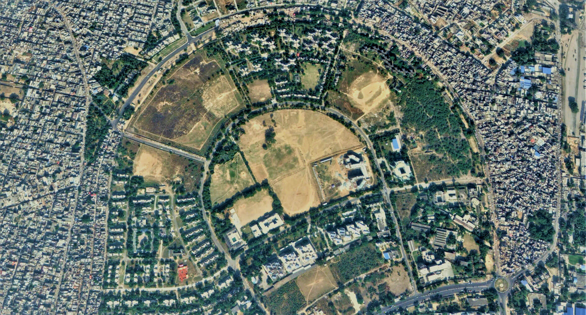

# GroundTruth — DTP Enforcement Radar & UHI Risk Pipeline

**[Live App (TBD)]()** | **[Video Demo (TBD)]()** | **[DevPost Blog (TBD)]()**



**GroundTruth** is an automated satellite surveillance dashboard built for the District Town Planner (DTP) of Faridabad. It acts as an early-warning radar to detect unauthorized colonies and illegal plot carving on agricultural lands. 

By identifying ~1 ha demonstrated vegetation loss, the pipeline flags the destruction of critical thermal buffers—with the intended goal of enabling government enforcement before permanent concrete structures are laid. It fuses AWS Open Data, morphological algorithms, and Multimodal Generative AI (Amazon Bedrock) into an actionable GovTech decision-support tool.

*Built for the WeMakeDevs / AWS Hackathon.*

---

## 📖 Table of Contents
- [Why this exists](#-why-this-exists)
- [Hackathon Track](#-hackathon-track)
- [Key Features](#-key-features)
- [Architecture & Folder Structure](#-architecture--folder-structure)
- [Results & Benchmarks](#-results--benchmarks)
- [Limitations & Guardrails](#-limitations--guardrails)
- [Installation & Setup](#-installation--setup)
- [Responsible Use](#-responsible-use)

---

## 🌍 Why this exists

For over a decade, Faridabad has struggled with the unchecked spread of unauthorized colonies. "Plot carving" typically begins by clearing agricultural land and laying rudimentary dirt tracks, destroying the surrounding ecosystem before any concrete is poured. 

*(Insert your ground photo here: ``)*

This unchecked concrete expansion destroys natural thermal buffers and creates massive **Urban Heat Islands (UHIs)**. While the pipeline focuses on tracking vegetation loss, halting this expansion is also a critical defense against rising localized temperatures and eventual light pollution (protecting the night sky).

---

## 🏆 Hackathon Track
**Heat and Water**
This pipeline supports UHI mitigation by empowering government forces (like the DTP) to reclaim and mandate plantation drives on illegally cleared agricultural land.

---

## 🚀 Key Features

1. **Cloud-Native STAC Ingestion:** Performs windowed reads of 10m-resolution Sentinel-2 Cloud-Optimized GeoTIFFs (COGs) directly from the AWS Open Data Registry (S3) via the STAC API, bypassing massive local downloads.
2. **Morphological Pruning:** Uses `scipy.ndimage` to compute NDVI drops, extract contiguous clusters, and apply geometric fill-ratios (>= 0.65) to automatically suppress sensor swath-edge artifacts.
3. **FMDA GIS Cross-Referencing:** Validates anomalies against the Faridabad Master Plan 2031 (Live State GIS Server) and Baseline Land Use (Mock/Cached).
4. **Visual Triage Assistant (Amazon Bedrock):** Dispatches high-probability crops to Amazon Bedrock (Claude). The LLM acts as a triage assistant to recommend whether a field inspector is required.
5. **Detection Floor:** Successfully demonstrated on ~1 ha demonstrated clearing (approx. 1 ha baseline).

---

## 🏗️ Architecture & Folder Structure

```text
GroundTruth/
├── .streamlit/
│   └── config.toml           # AWS dark theme configurations
├── core/
│   ├── bedrock.py            # AWS Bedrock invocation (Claude) and S3 triage uploads
│   ├── detection.py          # NDVI calculation, clustering, artifact suppression
│   └── stac_ingestion.py     # pystac-client search, COG window reads, timeseries caching
├── frontend/
│   └── app.py                # Main Streamlit dashboard UI
├── integrations/
│   └── fmda.py               # Spatially joining clusters with FMDA zoning
├── utils/
│   └── config.py             # Constants, threshold variables, region bounding boxes
├── Data/
│   ├── background_image.jpg  # Hero background image
│   └── cache/                # STAC queries cache (.npz, .json)
├── requirements.txt          # Python dependencies
├── .env.example              # Template for AWS environment variables
└── README.md                 # Project documentation
```

---

## 📊 Results & Benchmarks

| Region | Scan Window (T0 vs T1) | Raw Extracted | Suppressed (Artifacts) | Watchlist | Candidates | Verified Outcome |
|--------|-----------------------|---------------|-------------------|------------|-----------------------|------------------|
| **Ballabgarh Agro Belt** | Aug 21, 2024 vs Sep 15, 2024 | 45 | 32 | 13 | 0 | 1 known positive (~1 ha) flagged successfully. Cluster 8 flagged for review; NDVI history suggests possible crop cycle. |
| **Aravalli Ridge Corridor** | Sep 30, 2026 vs Oct 10, 2026 | 28 | 15 | 13 | 0 | Live surveillance test boundary |

*(Note: Validation metrics above represent specific benchmark tests during the hackathon development phase).*

### Screenshots
<!-- TODO: Insert screenshot images here -->
---

## 🚧 Limitations & Guardrails

### Known Limitations
* **Resolution Limits:** Relies on Sentinel-2 10m resolution; cannot reliably detect clearing smaller than 0.5 ha.
* **Cloud Cover:** Indian monsoon seasons (July-September) heavily obscure optical satellite visibility, limiting real-time response.
* **Terrain Shadows:** Aravalli hill terrain shadows can occasionally trigger false-positive NDVI drops during winter sun angles.
* **Seasonal Vegetation:** Agricultural crop cycles (harvesting) mimic plot carving. Requires temporal persistence tracking to avoid flagging bare winter fields. Note: Persistence tracking is a planned next step.

### Guardrails
* **Bounded Scans:** Bound by 4 preset regional bounding boxes (e.g., Aravalli, Ballabgarh) to strictly cap memory consumption and STAC query volume.
* **Caching:** Implements heavy local disk caching for STAC queries and FMDA legends to prevent redundant AWS egress and handle live GIS server timeouts.

---

## 🛠️ Installation and Setup

### 1. Clone the Repository
```bash
git clone https://github.com/gaurvais/groundtruth.git
cd groundtruth
```

### 2. Environment Variables
Copy `.env.example` to `.env` and add your AWS credentials. Bedrock requires access to Claude Sonnet 4.6 in `ap-southeast-2` (or your configured region).

```env
AWS_ACCESS_KEY_ID=your_access_key
AWS_SECRET_ACCESS_KEY=your_secret_key
AWS_DEFAULT_REGION=ap-southeast-2
GROUNDTRUTH_BEDROCK_MODEL=au.anthropic.claude-sonnet-4-6
```

### 3. Install & Run
```bash
pip install -r requirements.txt
streamlit run frontend/app.py
```

---

## ⚖️ Responsible Use
This pipeline generates **Decision Support** data, not legal findings. Outputs (including `FLAG_FOR_REVIEW`) are designed to prioritize and dispatch physical government field inspectors. The AI (Amazon Bedrock) is used strictly as a triage assistant for pixel pattern recognition and is completely decoupled from any statutory legal judgments.
